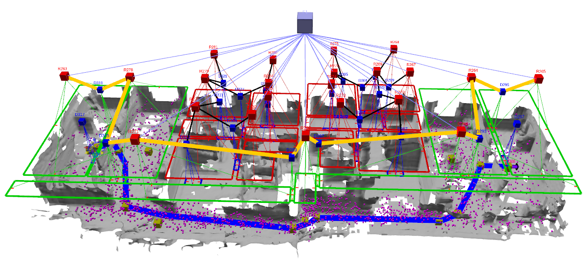

<div align="center">
    <h1>Situationally Aware Path Planning</h1>
    <p>Includes all dependencies for the S-Path planner built on the ROS Jazzy Framework</a></p>
</div>

Repository to setup situationally aware path planning from setup to execution on robot.

S-Path (developed under milestone 3 of euroBIN SATORI project) is a novel hierarchical semantic-geometric planning solution that combines S-Graphs with an informed geometric planner, providing the following benefits over traditional, purely geometric planners:
* The geometric search can greatly profit from a rough initial guess provided by the semantic layer by virtue of constraining the areas the planner can visit and by providing subgoals toward the final goal.
* A query in natural form, e.g., 'go from here to the kitchen', can easily be mapped to a semantic-geometric problem.
* Handling forbidden areas such as closed doors or rooms that should not be traversed is trivial on the semantic layer, whereas it would require map changes on the geometric layer. 



## Setup
We provide a complete docker environemnt setup to seemlesly setup the S-Path and its dependencies.

1. First, clone the snav-bringup repository: 


```bash
git clone git@github.com:snt-arg/snav_bringup.git -b main

```

2.  Navigate to docker folder and build the docker. This should clone S-Path with all its dependencies and build it inside a ROS2 workspace:

```bash
cd docker && docker compose build

```

3. Next execute the docker container:

```bash
docker compose up -d && docker exec -ti snav_ros2 bash

```

S-Path need both the semantic graph and the metric map obtained from `voxblox` by integrating the LIDAR measurements.


4. Configure the `is_graphs.launch` to generate the semantic graph:

```
<param name="wall_file_path" value="$(find is_graphs)/config/csv_walls.csv"/>
<param name="room_file_path" value="$(find is_graphs)/config/csv_rooms.csv" />
<param name="door_file_path" value="$(find is_graphs)/config/csv_doors.csv" />
```

5. mprocs: launch `IS_graph`
6. mprocs: launch `rviz`
7. mprocs: launch `carta_rt`
8. mprocs: launch `navigator_hl`
9. mprocs: launch `navigator_sgraphs`

Now in rviz you will see the contours of the metric-semantic graph (you may have to zoom), but without the metric map. 

10. Load the netric map by calling the `/carta/load_map_and_update` pointing it to our map e.g., `/some/path/map.voxblox`. Now you should have both the semantic-metric layer and the metric map.

11. In `rviz`, go to the Planning tab, pick a room for start and goal from the comboboxes.
Call:
   * The basic planner by clicking on `Planner Service`
   * The hierarchical planner by clicking on `Planner Hierarchical`
   * The hierarchical planner with subproblems by clicking on `Planner Hierarchical + SPS`

This will generate a list of collision free waypoints for the robot to follow. Next depending on your robot setup, you can use any path follower to test the resulting path. In our case we used the Boston Dynamics SPOT robot, and we provide the SPOT path follower in ROS2 (spot_bringup_utils) with this repository to test.
